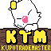

<h1>
  
  KupoTradeMaster
</h1>


A market-board sidekick for FFXIV crafters and flippers. Find good buys, know what your retainers need, and track every gil you spend and earn, all in one plugin. No auto-clickers, no bots. It shows you the numbers. You decide.

## What you get

- **A ranked feed of what to flip.** Your watchlist, sorted by real post-tax profit, updated as prices move.
- **Cross-world arbitrage.** Buy where it's cheap, sell where you play. The math is done for you.
- **An automatic trade journal.** Purchases and retainer sales log themselves. Session profit is right there at the top.
- **A wealth graph.** Watch your gil grow. Cash, bags, saddlebag, retainers, and active listings all counted, plotted over time.
- **Restock lists.** Say what each retainer should hold. Get a to-craft list of the gap.
- **A crafting buylist.** Paste any Artisan or TeamCraft list. See only the raw materials you still need, with the cheapest world to buy each from.
- **Realistic pricing.** Sell values are scoped to your own home world. No more fantasy margins from a mispriced foreign listing that pretends Gysahl Greens are worth three million gil.
- **Optional custom buy rules.** Set your own definition of a good price. Something like `dbmarket * 0.7` gets flagged the moment an item drops below 70% of average.
- **Multi-character.** Every entry gets tagged by which character earned or spent the gil, so alt rollups stay clean.
- **In-game tooltip.** Hover any item and see the current market floor. Toggle it off if you already use another price tooltip.

## Install

In game, type `/xlsettings`. Under the Experimental tab, paste this into Custom Plugin Repositories and click plus:

```
https://raw.githubusercontent.com/hanamigg/kupotrademaster/main/pluginmaster.json
```

Save. Open the plugin installer with `/xlplugins`, search for KupoTradeMaster, and hit Install. Then `/ktm` opens the window.

## Plays with

Allagan Tools, AutoRetainer, Artisan, MarketBoardPlugin, PriceInsight, and Dagobert. All optional. Each one you have installed makes KupoTradeMaster a little smarter.

## Will not do

No auto-posting, no auto-cancelling, no auto-buying. If you want a real undercutter, Dagobert is the community standard and it does that job well. KupoTradeMaster is the "help me decide what to trade" tool.

## Credits

Market data from Universalis. Built on Dalamud. Inspired by TradeSkillMaster and OSRS Flipping Utilities.

